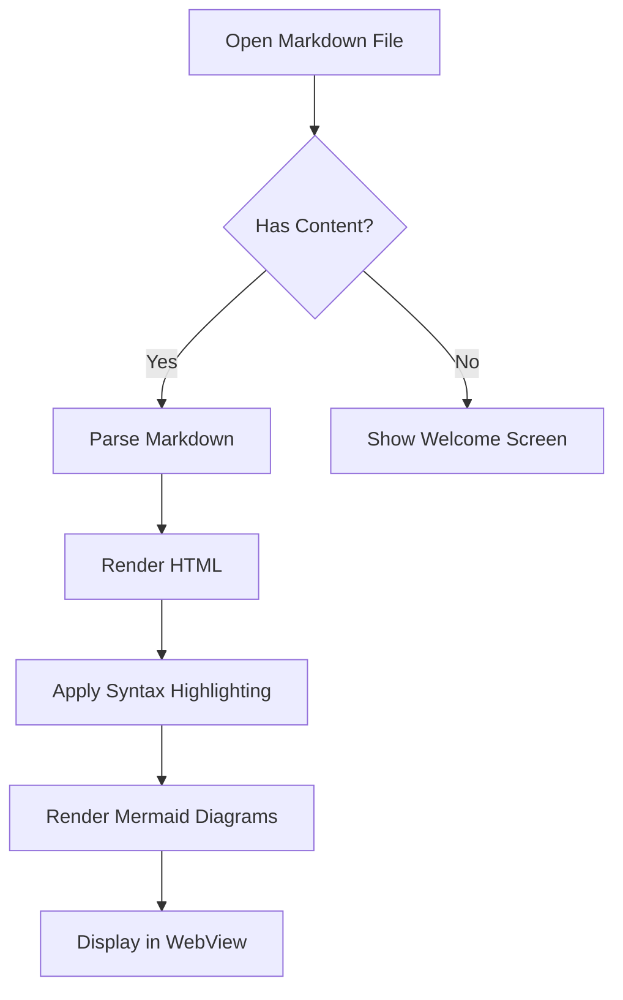
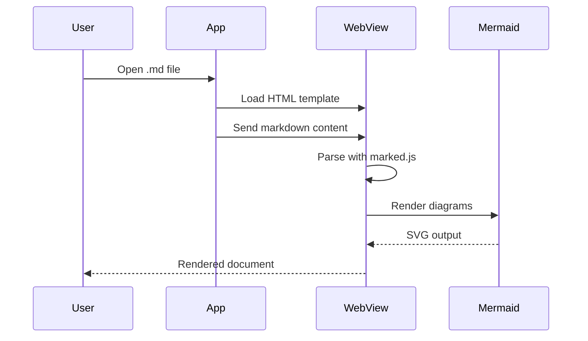
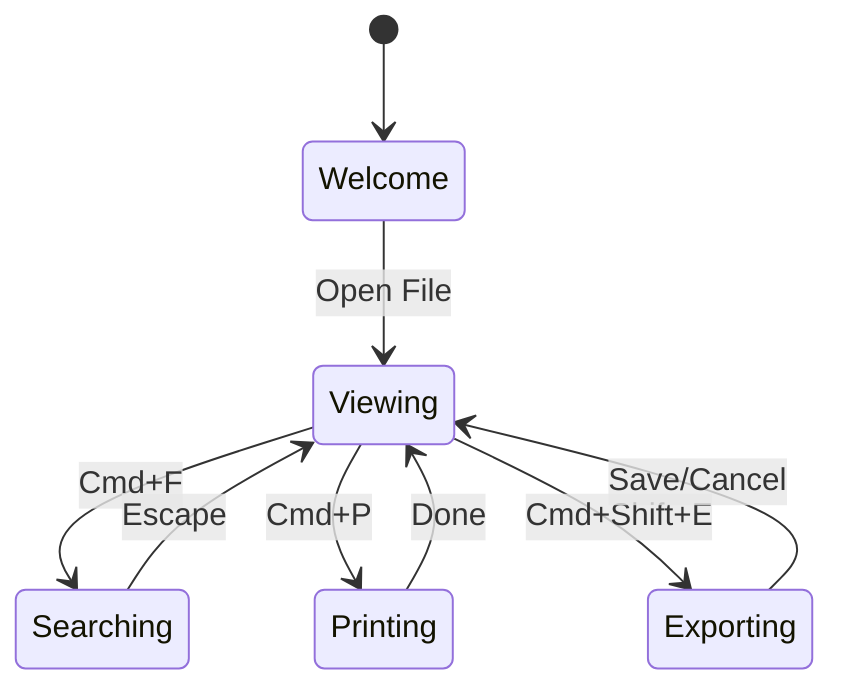

# Welcome to Darkmown

A beautiful, native macOS Markdown viewer with Mermaid diagram support.

## Features

- **Beautiful rendering** with GitHub-flavored Markdown
- **Mermaid diagrams** rendered inline
- **Syntax highlighting** for code blocks
- **Light and Dark mode** with smooth transitions
- **Table of Contents** sidebar with click-to-scroll
- **In-page search** with match highlighting
- **Export to HTML** for sharing

## Code Highlighting

Here's some Swift code:

```swift
struct ContentView: View {
    @State private var count = 0

    var body: some View {
        VStack {
            Text("Count: \(count)")
                .font(.largeTitle)
            Button("Increment") {
                count += 1
            }
        }
        .padding()
    }
}
```

And some Python:

```python
def fibonacci(n: int) -> list[int]:
    """Generate the first n Fibonacci numbers."""
    if n <= 0:
        return []
    fib = [0, 1]
    for _ in range(2, n):
        fib.append(fib[-1] + fib[-2])
    return fib[:n]

print(fibonacci(10))
```

## Mermaid Diagrams

### Flowchart



### Sequence Diagram



### State Diagram



## Tables

| Shortcut | Action | Description |
|----------|--------|-------------|
| Cmd+O | Open | Open a markdown file |
| Cmd+F | Find | Search within document |
| Cmd+P | Print | Print the rendered view |
| Cmd+R | Reload | Refresh the document |
| Cmd+= | Zoom In | Increase text size |
| Cmd+- | Zoom Out | Decrease text size |
| Cmd+0 | Reset | Reset to default zoom |

## Blockquotes

> "The best way to predict the future is to invent it."
> -- Alan Kay

> **Note:** Darkmown supports nested blockquotes and styled content within them.
>
> > This is a nested blockquote with `inline code`.

## Task Lists

- [x] Markdown rendering with marked.js
- [x] Syntax highlighting with highlight.js
- [x] Mermaid diagram support
- [x] Light/Dark mode theming
- [x] Table of Contents sidebar
- [x] In-page search
- [x] Print support
- [x] HTML export
- [ ] Even more features coming soon!

## Horizontal Rule

---

## Links and Images

Visit [GitHub](https://github.com) for more information.

## Math-like Formatting

The area of a circle is `A = pi * r^2` where `r` is the radius.

## Emphasis

This is **bold text** and this is *italic text*. You can also use ~~strikethrough~~ and `inline code`.

---

*Built with SwiftUI, WebKit, marked.js, highlight.js, and mermaid.js*
